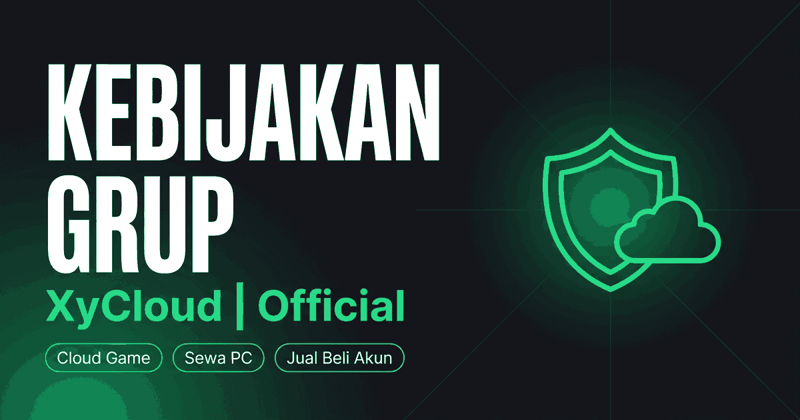

<div align="center">



# XyCloud Policy

**Kebijakan Grup / Saluran WhatsApp — XyCloud | Official**

Website statis + API publik + widget embed. Satu file JSON jadi sumber kebenaran untuk semuanya.

[](https://rules.xyc.my.id)
[](https://rules.xyc.my.id/api/policy)
[](LICENSE)

[Website](https://rules.xyc.my.id) · [Dokumentasi API](https://rules.xyc.my.id/docs) · [Endpoint JSON](https://rules.xyc.my.id/api/policy)

</div>

---

## Apa Ini

Halaman aturan komunitas yang biasanya cuma jadi pesan tersemat yang ga pernah dibaca, dijadikan website beneran — lengkap dengan SEO, Open Graph, dan API supaya komunitas lain bisa ikut memakainya.

Aturan intinya satu: **member yang keluar atau dikeluarkan dari Grup tidak bisa bergabung kembali.** Sisanya turunan dari situ.

## Fitur

| | |
|---|---|
| **Dua versi** | `/` versi publik (SEO-friendly) dan `/internal` versi blak-blakan (`noindex`) |
| **Dua bahasa** | `/` Bahasa Indonesia dan `/en` English, lengkap dengan deteksi bahasa browser + tombol ID/EN. Widget & gate ikut dua bahasa |
| **Satu sumber data** | Semua teks ada di [`data/policy.json`](data/policy.json) (id) + [`data/policy.en.json`](data/policy.en.json) (en). Edit di situ, jalankan build, semua ikut berubah |
| **API publik** | JSON, HTML, Markdown, dan teks polos. Tanpa API key, CORS terbuka |
| **Widget embed** | Satu baris `<script>` untuk menempelkan kebijakan di website mana pun |
| **Gate popup** | Pasang di link bio — orang harus baca & pencet setuju sebelum link WhatsApp kebuka |
| **Feedback** | Tombol suka/kurang, popup alasan, kiriman langsung masuk email admin via Resend |
| **SEO lengkap** | Canonical, hreflang id/en/x-default, robots, sitemap dengan alternates, dan 5 blok JSON-LD (WebSite, WebPage, Organization, FAQPage, BreadcrumbList) |
| **Open Graph penuh** | Banner 1200×630 untuk WhatsApp, Facebook, X, Telegram, Discord, LinkedIn, Threads, Pinterest |
| **Nol dependensi** | Tidak ada `node_modules`. HTML, CSS, dan JS murni |

## Struktur

```
xycloud-policy/
├── data/policy.json        # sumber kebenaran (id) — edit di sini
├── data/policy.en.json     # sumber kebenaran (en) — struktur identik, id section disamakan
├── scripts/
│   ├── build.mjs           # generator HTML, sitemap, robots, manifest, favicon
│   └── serve.mjs           # dev server lokal + emulasi /api
├── api/
│   ├── policy.js           # GET  /api/policy
│   ├── feedback.js         # POST /api/feedback (Resend)
│   └── health.js           # GET  /api/health
├── public/                 # hasil build + aset statis
│   ├── index.html          # (generated) versi publik
│   ├── internal.html       # (generated) versi internal
│   ├── en/index.html       # (generated) versi publik English (/en)
│   ├── en/internal.html    # (generated) versi internal English (/en/internal)
│   ├── docs.html           # dokumentasi API
│   ├── embed.js            # widget kebijakan
│   ├── gate.js             # popup persetujuan
│   ├── demo.html           # demo link bio + gate
│   └── og*.png             # 3 banner Open Graph 1200×630
└── vercel.json
```

## Jalankan Lokal

Butuh Node 18+. Tidak ada dependensi yang perlu diinstal.

```bash
git clone https://github.com/xykalnotkel/xycloud-policy.git
cd xycloud-policy

npm run dev      # build + serve di http://localhost:3000
npm run build    # build saja
```

## API

Base URL: `https://rules.xyc.my.id`

```bash
curl "https://rules.xyc.my.id/api/policy"                          # semua, JSON (id)
curl "https://rules.xyc.my.id/api/policy?lang=en"                  # semua, JSON (English)
curl "https://rules.xyc.my.id/api/policy?format=index"             # daftar section
curl "https://rules.xyc.my.id/api/policy?section=promosi"          # satu section
curl "https://rules.xyc.my.id/api/policy?format=markdown"          # Markdown
curl "https://rules.xyc.my.id/api/policy?format=text"              # teks polos (buat bot)
curl "https://rules.xyc.my.id/api/health"                          # status
```

**Parameter:** `lang` (id·en, default `id`) · `format` (json·html·markdown·text·index) · `section` (id/nomor) · `version` (public·internal, internal terkunci — lihat Environment) · `pretty` (1)

Bahasa yang diminta tercermin di header `X-Policy-Language` dan `meta.requestedLanguage` / `meta.availableLanguages`.

**Section:** `keluar-masuk` `kelakuan` `promosi` `transaksi` `ketipu` `ngeyel` `larangan` `sanksi` `saluran` `privasi` `admin`

Dokumentasi lengkap dengan contoh React, PHP, dan bot: **[rules.xyc.my.id/docs](https://rules.xyc.my.id/docs)**

## Gate Popup

Pasang di link bio. Orang pencet link WhatsApp → kebijakan muncul dulu → tombol Setuju nyala setelah discroll sampai bawah → baru link kebuka.

```html
<script src="https://rules.xyc.my.id/gate.js" defer></script>
<a href="https://wa.me/6283116632566" data-xyc-gate>Japri Admin</a>
```

Mode otomatis untuk semua link WhatsApp: `data-auto="wa"`. Dirender di Shadow DOM jadi CSS tidak bentrok. [Demo](https://rules.xyc.my.id/demo)

## Dua Bahasa (ID / EN)

Website, API, widget, dan gate semuanya dua bahasa:

- **Halaman:** `/` (Indonesia) dan `/en` (English), masing-masing punya pasangan `/internal` dan `/en/internal`. Kedua bahasa saling terhubung lewat hreflang + sitemap alternates, jadi Google mengindeks keduanya.
- **Deteksi otomatis:** kunjungan pertama (sebelum pengunjung memilih manual) dicek bahasa browsernya — `id` → versi Indonesia, selain itu → versi English. Bot crawler dan social scraper dikecualikan supaya SEO/OG tiap URL tetap utuh.
- **Tombol ID/EN** di pojok header: pilihan manual, disimpan di `localStorage` (`xyc_lang`) dan menang atas deteksi otomatis selamanya.
- **API:** `?lang=en` (default tetap `id`, jadi pemanggil lama tidak berubah).
- **Widget & gate:** `data-lang="id|en|auto"` di tag `<script>` (default `auto` — ikut bahasa browser pembacanya). Gate juga bisa per-panggilan: `XycGate.open(url, '_blank', { lang: 'en' })`.

```html
<!-- gate selalu English, apa pun bahasa browser pengunjung -->
<script src="https://rules.xyc.my.id/gate.js" data-lang="en" defer></script>
```

## Widget

```html
<div id="xyc-policy"></div>
<script src="https://rules.xyc.my.id/embed.js" defer></script>
```

Dengan opsi:

```html
<script src="https://rules.xyc.my.id/embed.js"
        data-target="#kebijakan"
        data-theme="dark"
        data-section="promosi"
        data-accent="#00ff88"
        data-lang="auto"
        defer></script>
```

`data-theme` mengikuti `prefers-color-scheme` secara default, dan widget memancarkan event `xyc:policy:loaded` setelah render.

## Pakai untuk Komunitas Sendiri

Boleh, gratis, lisensi MIT. Dua syarat:

1. **Minta izin dulu** ke [Admin XyCloud](https://wa.me/6283116632566) sebelum dipakai.
2. **Cantumkan kredit** balik ke `rules.xyc.my.id`. Widget sudah otomatis menambahkannya — mohon jangan dimatikan.

Kalau mau fork total, cukup ubah blok `meta` di `data/policy.json` (nama, domain, nomor admin, tag, keyword), lalu `npm run build`. Mau bahasa lain? Terjemahkan `data/policy.en.json` jadi bahasa apa pun (jaga `id` section tetap sama), atau hapus file itu + dua baris `POLICIES` di `scripts/build.mjs` dan `api/policy.js` kalau mau balik satu bahasa.

## Environment

Hanya dibutuhkan untuk endpoint feedback:

```
RESEND_API_KEY=re_xxx
FEEDBACK_TO=email@tujuan.com
FEEDBACK_FROM=Nama <noreply@domain-kamu.com>
POLICY_INTERNAL_KEY=rahasia-kalau-mau-buka-versi-internal
```

`POLICY_INTERNAL_KEY` opsional. Kalau tidak diset, `?version=internal` di API menolak
dengan 403 (versi internal dianggap rahasia dan tidak boleh bocor lewat API publik atau
widget embed). Kalau diset, pemanggil harus mengirim kunci yang sama lewat header
`X-Policy-Internal-Key` atau parameter `?key=`.

## Deploy

Dirancang untuk Vercel, tapi jalan di mana saja.

- **Static host** (Netlify, Cloudflare Pages, GitHub Pages): deploy folder `public/`. API tidak ikut, tapi website tetap utuh.
- **Dengan API**: butuh runtime Node 18+ untuk folder `api/`.

```bash
vercel --prod
```

## Kontribusi

Isu dan pull request diterima. Untuk perubahan teks aturan, edit `data/policy.json` — jangan edit `public/index.html` atau `public/internal` langsung karena akan tertimpa saat build.

## Lisensi

[MIT](LICENSE) © 2026 XyCloud | Official
